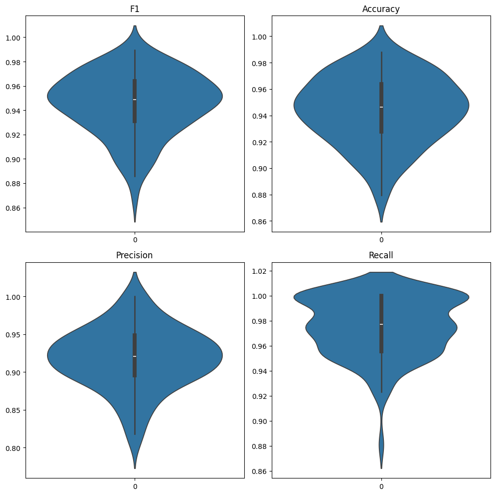
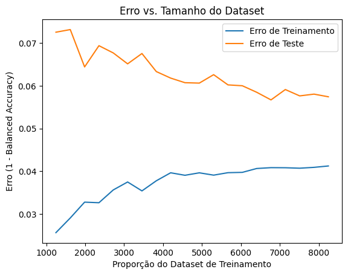

# Classificação de Texto no Dataset ``Hate Speech and Offensive Language Dataset``

Este projeto tem como objetivo construir, analisar e melhorar uma pipeline de classificação de textos utilizando um dataset de classificação previamente rotulado. Através de métodos de processamento de linguagem natural (NLP), análises de erros e modelagem de tópicos, foi buscado entender o desempenho do modelo e identificar formas de aprimorá-lo.

## 1. Obter o Dataset

O dataset ``Hate Speech and Offensive Language Dataset`` utilizado para a classificação de texto pode ser baixado do **Kaggle**, o link você pode encontrar clicando [aqui](https://www.kaggle.com/datasets/mrmorj/hate-speech-and-offensive-language-dataset?resource=download), assim como o paper original da aplicação você pode encontrar [aqui](https://arxiv.org/pdf/1703.04009).

### Aplicação

Um desafio inerente ao contexto de redes sociais é a classificação automática de instâncias de textos tóxicos, tais como o discurso de ódio e a linguagem ofensiva. Nesse sentido, a classificação automática se torna uma tarefa fundamental para a identificação de conteúdo nocivo e a proteção de usuários vulneráveis. Neste projeto, utilizamos um dataset de classificação de texto para treinar um modelo de classificação de texto capaz de identificar automaticamente conteúdo tóxico em redes sociais com base em tweets.


## 2. Pipeline de classificação

A pipeline completa foi dividida em duas etapas: ``prepro_features`` e  ``pipeline``. A primeira etapa é responsável por realizar o pré-processamento dos dados, enquanto a segunda etapa é responsável por treinar o modelo de classificação e avaliar seu desempenho. O pré-processamento inclui as seguintes etapas:

### Pré-processamento de Texto

Para o pré-processamento dos textos, foram utilizadas as seguintes técnicas:

- Remoção de stopwords e pontuação
- Lematização
- Vetorização com TF-IDF

Dessa forma, a implementação você pode acompanhar abaixo:

```python

class PreproTweets(BaseEstimator, TransformerMixin):
    def __init__(self):
        pass

    def fit(self, X, y=None):
        return self

    def transform(self, X, y=None):
        return [self.preprocess_text(text) for text in X]

    def preprocess_text(self, text):
        text = text.lower()
        text = re.sub(r'\d+', '', text)
        text = re.sub(r'\b\w{1,2}\b', '', text)  
        text = re.sub(r'[^\w\s]', '', text) 
        text = ' '.join(lemmatizer.lemmatize(word) for word in text.split() if word not in stop_words)
        return text

pipeline_prepro_features = Pipeline([
    ('prepro', PreproTweets()),
    ('tfidf', TfidfVectorizer()),
])

``` 

### Junção de classes

Devido a complexidade envolvida em classificar **hate speech e neither**, vamos considerar a classificação de offensive language e todo o resto, dessa forma transformando o problema numa classificação binária. O intuito dessa abordagem é simplificar o problema e tornar o modelo mais eficiente.

### Equilibrando datasets

Além disso, vamos também equilibrar os datasets para que o modelo não seja enviesado para uma classe específica. Para isso, vamos utilizar a técnica de **undersampling**, na qual vamos reduzir a quantidade de amostras da classe majoritária para que ela fique balanceada com a classe minoritária.

```python

down_sample = target.value_counts().min()
texts_target_undersampled = pd.concat([texts_target[texts_target['class'] == 0].sample(down_sample, random_state=42),
                                        texts_target[texts_target['class'] == 1]])
```


### Pipeline de Classificação

Para a classificação dos textos, foram utilizados os seguintes modelos:

- Regressão Logística

```python

pipeline_prepro_features = Pipeline([
    ('prepro', PreproTweets()),
    ('tfidf', TfidfVectorizer()),
])

pipeline = Pipeline([
    ('prepro_features', pipeline_prepro_features),
    ('log_reg', LogisticRegression()),
])

```

### Classificador com "dúvida"

Após treinar de forma preliminar o modelo, foi identificado que o modelo estava tendo dificuldades em classificar corretamente algumas instâncias. Para explorar inicialmente, foi criada uma lista com a entropia de cada instância, ou seja, a incerteza do modelo em classificar a instância. A partir disso, foi possível identificar instâncias que o modelo estava tendo dificuldades em classificar. Alguns casos foram trazidos aqui para análise.

    
1. **Uso de palavras ofensivas em contextos neutros**: Vários tweets contêm palavras consideradas ofensivas, como "retard" ou "fag", mas são usadas de maneira "neutra", sem necessariamente uma intenção de hate speech. Por exemplo:

- "I sound retarded but he is learning quickly!"
- "I'm getting sleepy and my phone is acting retarded..."

Esses exemplos podem confundir o modelo, pois as palavras são normalmente associadas a conteúdo ofensivo, mas o contexto aqui é menos agressivo. O classificador parece sensível a palavras isoladas sem entender totalmente o contexto.

2. **Incerteza na polaridade emocional**: Alguns tweets expressam emoções de forma vaga ou confusa, dificultando a categorização precisa:

- "I picked Welbeck for my team. I have to be some kind of **** yes"

A linguagem usada é agressiva, mas pode estar sendo usada de maneira casual ou humorística, o que torna difícil identificar se a intenção é ofensiva.


## 3. Avaliando modelo

Para garantir uma avaliação robusta do modelo, foi utilizada a **validação cruzada com K-Folds**, onde o conjunto de dados é dividido em 100 subconjuntos ou "folds". A cada iteração, o modelo é treinado em 99 desses folds e testado no fold restante, repetindo esse processo até que todos os folds sejam utilizados como conjunto de teste exatamente uma vez. O uso de 100 folds ajuda a reduzir a variabilidade associada à partição do conjunto de dados e oferece uma estimativa mais estável das métricas de desempenho. As principais métricas de avaliação incluídas são **F1-Score, acurácia, precisão e revocação**, cujas médias e desvios-padrão são calculados ao longo de todas as iterações para fornecer uma visão mais clara da performance do modelo.

Além disso, foi gerado gráficos da distribuição de cada métrica para cada fold, a fim de identificar possíveis variações no desempenho do modelo em diferentes subconjuntos de dados. A seguir, são apresentados os resultados obtidos para o modelo de classificação.

<center>

</center>

### Palavras mais importantes

Para compor melhor o estudo do classificador, foi feita uma análise das palavras mais importantes para a classificação. Através do coeficiente da regressão logística, foi possível identificar as palavras que mais influenciam na classificação do modelo. A seguir, são apresentadas as palavras mais importantes para cada classe com seus respectivos pesos.

- Palavras que mais contribuem positivamente para a classe alvo:

> bird: 5.8814

> trash: 5.6385

> yankee: 4.9584

> charlie: 4.4743

> yellow: 4.2395

> oreo: 3.2637

> brownie: 3.1533

> monkey: 2.6483

> mock: 2.5598

> colored: 2.4811

- Palavras que mais contribuem negativamente (associadas à classe oposta):

> b-tch: -20.3141

> h-e: -11.0728

> p-ssy: -9.5015

> s-it: -5.6626

> f-ggot: -5.4129

> as: -5.0832

> n-gga: -4.9130

> f-ck: -4.8490

> f-g: -4.4652

> n-gger: -4.3939

Do ponto de vista da classe hate/offensive, faz sentido as palavras que contribuem negativamente para a classificação devido ao seu caráter claramente ofensivo. Por outro lado, as palavras que contribuem positivamente para a classificação da classe neutra são um pouco mais difíceis de interpretar. A presença de palavras como "bird", "trash" e "yellow" pode ser um indicativo de que o modelo está associando essas palavras a contextos neutros, mas é difícil inferir uma interpretação precisa sem mais contexto.


## 4. Modificando o tamanho do dataset

Vamos variar o tamanho do dataset gradativamente para enxergar o comportamento dos gráficos e das métricas de avaliação.

<center>

</center>

A partir da análise do gráfico de **Erro vs. Tamanho do Dataset**, que avalia o desempenho do modelo em diferentes proporções do conjunto de dados de treinamento, é possível observar que tanto o erro de treinamento quanto o erro de teste diminuem conforme o tamanho do dataset aumenta. No entanto, à medida que mais dados são incluídos, o ganho de precisão começa a diminuir. Isso sugere que, embora haja espaço para melhorar a acurácia do modelo com o aumento do tamanho do dataset, os retornos em termos de redução do erro se tornam cada vez menores, especialmente ao nos aproximarmos do uso completo do dataset. Portanto, a adição de mais dados pode continuar a melhorar a performance, mas é necessário ponderar se os custos e o tempo de coleta de mais dados são viáveis no contexto do caso de negócio. No contexto presente, como o insumo de treino é oriundo das redes sociais, o trabalho pode ser facilitado com acesso às APIs das redes sociais, que podem fornecer um volume maior de dados para treinamento.


## 5. Modelagem de Tópicos

Ao utilizar a modelagem de tópicos sobre o classificador, foi possível observar que para alguns tópicos, o modelo apresentou um desempenho melhor do que para outros. Isso levanta a questão de como a modelagem de tópicos pode ser usada para melhorar a performance do classificador, com a criação de modelos específicos para diferentes tópicos. 

## Conclusão - Two Layer Classifier

É possível notar que a performace do modelo quando ele é desenvolvido em duas camadas é melhor do que o modelo único. Isso se dá pelo fato de que o modelo consegue aprender melhor as características de cada tópico e classificar de forma mais precisa. A especificidade do modelo é um fator importante para a classificação de textos, pois permite que instâncias mais complexas de textos sejam tratadas de maneira mais específica e eficiente. 

Nesse sentido, é de suma importância que implementações como a análise de tópicos para a construção de modelos de classificação de texto nas redes sociais sejam consideradas, pois elas podem melhorar significativamente a performance do modelo e a qualidade das previsões, melhorando assim a experiência do usuário e a segurança online.


## Reference

- Link: https://www.kaggle.com/datasets/mrmorj/hate-speech-and-offensive-language-dataset?resource=download

- Paper: https://arxiv.org/pdf/1703.04009

- Paper: https://www.sciencedirect.com/science/article/pii/S2352340922010356

- Repositório do autor: https://github.com/t-davidson/hate-speech-and-offensive-language/tree/master